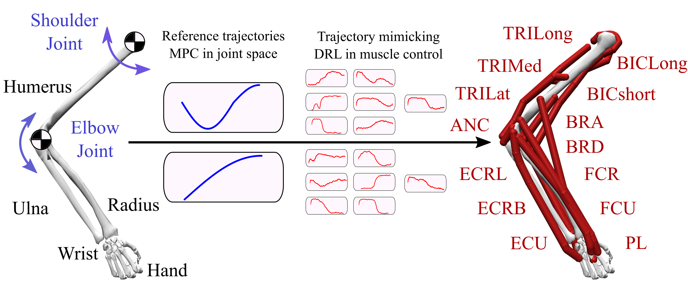

# Optimum trajectory learning in musculoskeletal systems with model predictive control and deep reinforcement learning

Berat Denizdurduran, Henry Markram, Marc-Oliver Gewaltig - Biol Cybern. 2022; 116(5-6): 711–726



## Summary

From the computational point of view, musculoskeletal control is the problem of controlling high degrees of freedom and dynamic multi-body system that is driven by redundant muscle units. A critical challenge in the control perspective of skeletal joints with antagonistic muscle pairs is finding methods robust to address this ill-posed nonlinear problem. To address this computational problem, we implemented a twofold optimization and learning framework to be specialized in addressing the redundancies in the muscle control . In the first part, we used model predictive control to obtain energy efficient skeletal trajectories to mimick human movements. The second part is to use deep reinforcement learning to obtain a sequence of stimulus to be given to muscles in order to obtain the skeletal trajectories with muscle control. We observed that the desired stimulus to muscles is only efficiently constructed by integrating the state and control input in a closed-loop setting as it resembles the proprioceptive integration in the spinal cord circuits. In this work, we showed how a variety of different reference trajectories can be obtained with optimal control and how these reference trajectories are mapped to the musculoskeletal control with deep reinforcement learning. Starting from the characteristics of human arm movement to obstacle avoidance experiment, our simulation results confirm the capabilities of our optimization and learning framework for a variety of dynamic movement trajectories. In summary, the proposed framework is offering a pipeline to complement the lack of experiments to record human motion-capture data as well as study the activation range of muscles to replicate the specific trajectory of interest. Using the trajectories from optimal control as a reference signal for reinforcement learning implementation has allowed us to acquire optimum and human-like behaviour of the musculoskeletal system which provides a framework to study human movement in-silico experiments. The present framework can also allow studying upper-arm rehabilitation with assistive robots given that one can use healthy subject movement recordings as reference to work on the control architecture of assistive robotics in order to compensate behavioural deficiencies. Hence, the framework opens to possibility of replicating or complementing labour-intensive, time-consuming and costly experiments with human subjects in the field of movement studies and digital twin of rehabilitation.

## Getting started

This repository contains the source code of the paper titled "Optimum trajectory learning in musculoskeletal systems with model predictive control and deep reinforcement learning". The project is built upon an existing musculoskeletal simulation framework, [opensim-rl](https://github.com/stanfordnmbl/osim-rl) and
a model-predictive library, [do-mpc](https://www.do-mpc.com/en/latest/). If you'd like to contribute and/or use this project, you should:

- Follow the instructions given [opensim-rl](https://github.com/stanfordnmbl/osim-rl) to prepare the simulation environment.
- Once the opensim-rl is properly setup, please install the necessary additional packages that have been used in this project by typing
`pip install -r requirements.txt` (it is recommended you do this within the conda environment).

## How to execute the scripts

To execute the model predictive control (in mpc folder) and obtain optimum shoulder and elbow trajectories"

```python
python model_learning.py --show_animation True --store_animation True --store_results True -r [NAME]
```

in case of obtaining trajectories for different objectives, please refer to ``template_mpc.py`` in order to define your objective function.

Once the optimum trajectories have been obtained, the musculoskeletal learning (in drl folder) can be executed as follows:

```python
python arm_learning.py
```

To test the learned models:

```python
python arm_testing.py -mi [MODEL_ID] -c [NUMBER_OF_TEST] -ns [NUMBER_OF_STEPS]
```

## Dependencies

- opensim-rl
- do-mpc
- casadi
- matplotlib
- numpy
- ffmpeg
- [ImageMagick](https://imagemagick.org/index.php) (animation)

### References

If you find the code useful for your research, please consider citing

```bib
@article{denizdurduran2022optimum,
  title={Optimum trajectory learning in musculoskeletal systems with model predictive control and deep reinforcement learning},
  author={Denizdurduran, Berat and Markram, Henry and Gewaltig, Marc-Oliver},
  journal={Biological cybernetics},
  volume={116},
  number={5},
  pages={711--726},
  year={2022},
  publisher={Springer}
```

### License

The repository is licensed under the [Apache License 2.0](LICENSE).

### Acknowledgements

This project was partially funded by the EPFL Blue Brain Project Fund and the ETH Board Funding to the Blue Brain Project. The project also received funding from the European Union’s Horizon 2020 Framework Programme for Research and Innovation under Specific Grant Agreement No: 945539 (Human Brain Project SGA-3)
